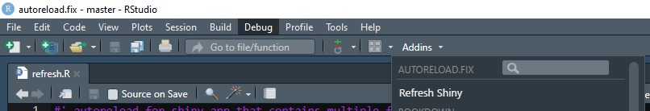
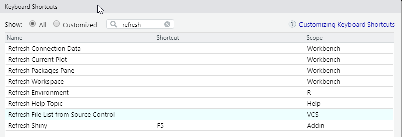
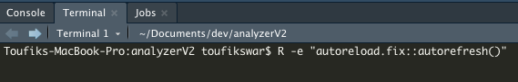

<!-- README.md is generated from README.Rmd. Please edit that file -->
<!-- badges: start -->

<!-- badges: end -->

# autoreload.fix

Provides two solutions to refresh a Shiny App.

The `option(shiny.autoreload = TRUE)` automatically refreshes a Shiny
app, however it comes with an issue. When working with multiple files
(outside of app.R) the UI isnt refreshed properly. For instance, when
working with modules or a `golem` you have to reboot the app in order to
see UI changes.

This package provides two workarounds by updating the `file.mtime` of
app.R when a file in /R folder is updated or added (e.g., the latest
`file.mtime` of this folder changes)  
1) Refresh  
2) Autorefresh

## Install

`devtools::install_github("https://github.com/vreederene-90/autoreload.fix")`

## Global option needed for both options

`option(shiny.autoreload = TRUE)`

## Refresh

After installation an Addin is added, which makes it possible to make a
shortcut to the function `autoreload.fix::refresh()`. For example, you
can bind it to F5. When executed, it refreshes the app. It is assumed
the “app.R” file is in the project root.

  

## Autorefresh

A Shiny app is started with `autoreload.fix::autorefresh()` that watches
the /R folder and updates automatically when the `file.mtime` changes of
the files in the /R folder.  
It is advised to run this function via a terminal session (e.g.,
`R -e "autoreload.fix::autorefresh()"`) from the root of the project
folder.

In addition, the project you are actually working on has to be run from
a terminal (or external job) as well.

