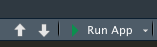
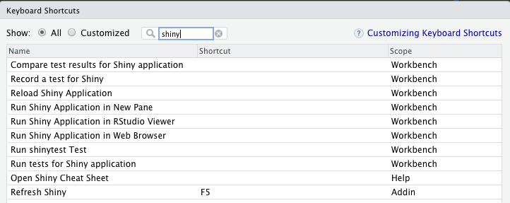
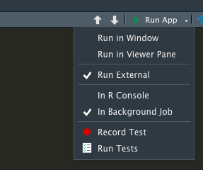
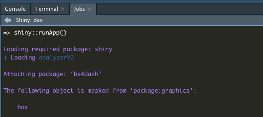
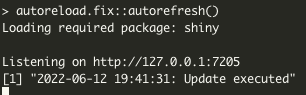

<!-- README.md is generated from README.Rmd. Please edit that file -->
<!-- badges: start -->

[](https://lifecycle.r-lib.org/articles/stages.html#experimental)
<!-- badges: end -->

# Documentation (autoreload.fix)

# Objective

The `options(shiny.autoreload = TRUE)` automatically refreshes a Shiny
app, however it comes with an issue.

When working with multiple files (outside of `app.R`) the UI isn’t
refreshed properly. For instance, when working with modules or a `golem`
you have to reboot the app in order to see UI changes.

This package provides two workarounds by updating the `file.mtime` of
`app.R` when a file in `R/` folder is updated or added (e.g., the latest
`file.mtime` of this folder changes)

The package offers 2 update options:

-   Refresh : Updates the content of your page by pressing a keyboard
    key that you can preset (e.g. `F5`)
-   Auto-refresh : Automatically updates the content on the page when
    changes are saved in RStudio

# Practical trick

For the ease of simplicity, in your `golem` project, go to the `dev/`
folder of your app and rename the `run_dev.R` file to `app.R`

This will allow you to run the Shiny app via the Run App button in
RStudio, which is quite convenient.



# Install and config

Install the
[`autoreload.fix`](https://github.com/vreederene-90/autoreload.fix)
package by running in your R console:

``` r
devtools::install_github("https://github.com/vreederene-90/autoreload.fix")
```

Go to `app.R` (the previously named `run_dev.R` file) and add the below
option:

``` r
options(shiny.autoreload = TRUE)
```

## Option 1 - Refresh

This allows the app to update by pressing a keyboard key.

After you installed the
[`autoreload.fix`](https://github.com/vreederene-90/autoreload.fix)
package, in RStudio go to Keyboard Shortcuts and search for **Refresh
Shiny**.



I have set the refresh shiny option to my `F5` key. You can choose to
bind it to any key you want.

Go to the `app.R` (previously `run_dev.R`) and click on the small arrow
next to the **Run App** button. This will display the following dropdown
menu:



Select `Run External` and `In Background Job`. This step is mandatory to
make the package work.

Press **Run App**, to run your Shiny application as **Background job**
(you should see it loading in the `Jobs` tab in RStudio)



Edit a file in the `R/` folder of your Shiny project (e.g., make a
visual change in the UI)

Put the focus back to RStudio (i.e. click on your RStudio IDE window)

Press the `F5` key (or the key you bound the refresh too)

Your app should refresh and display the changes you made.

## Option 2 : Auto-refresh

This option allows to refresh each time a change is detected in the `/R`
folder.

Go to the `Terminal` tab in RStudio (between `Console` and `Jobs`) or
open a terminal window outside RStudio and run the following command:

``` bash
R -e "autoreload.fix::autorefresh()"
```

Example in my Terminal in RStudio:


This will open **an empty tab** in your browser, and it will listen to a
port on localhost. **Do not close this tab**.

Go to the `app.R` (previously `run_dev.R`) and click on the small arrow
next to the Run App button. This will display the following dropdown
menu:


Select `Run External` and `In Background Job`. This step is mandatory to
make the package work.

Press **Run App**, to run your Shiny application as **Background job**
(you should see it loading in the `Jobs` tab in RStudio)


Edit a file in the `R/` folder of your Shiny project (e.g., make a
visual change in the UI)

Press `cmd+s` / `ctrl+s` to save the change.

If you go to the terminal where you initially run the command
`R -e "autoreload.fix::autorefresh()"`, you should see the date and time
of your last change with the text *“Update executed”*.



Your app should refresh and display the changes you made.
